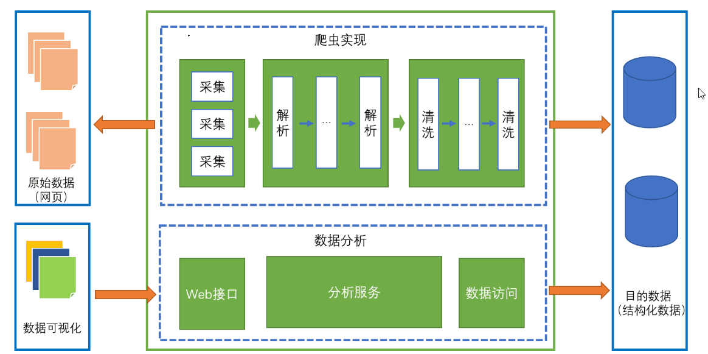
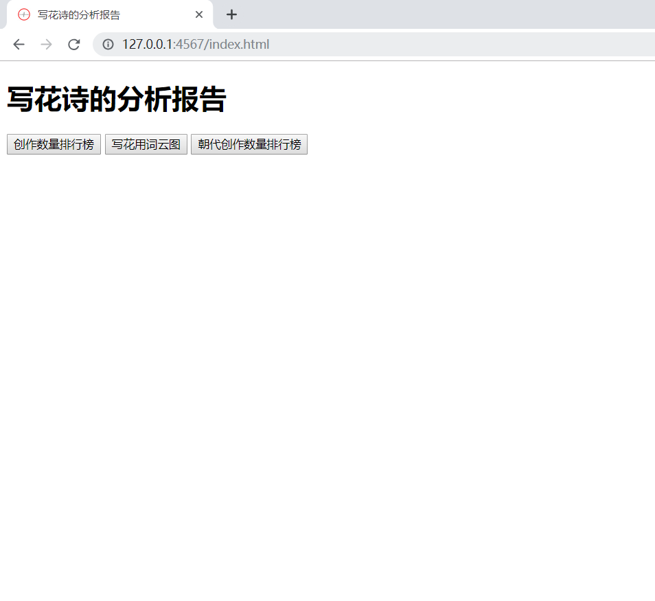
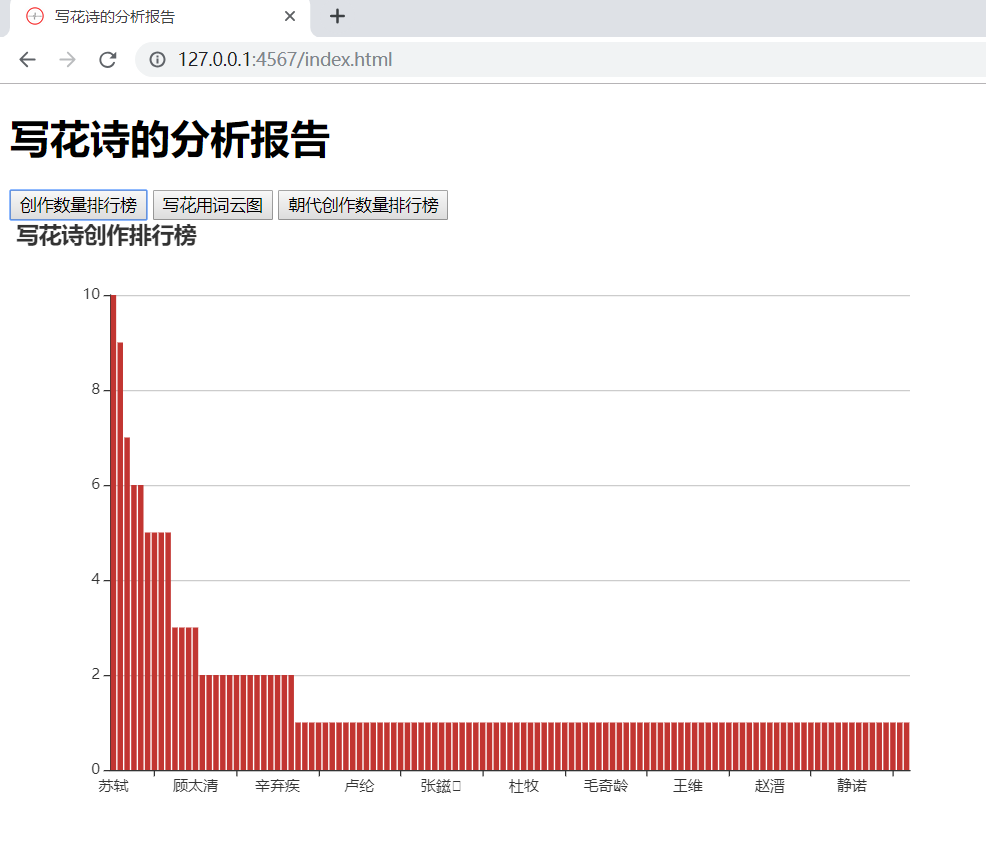
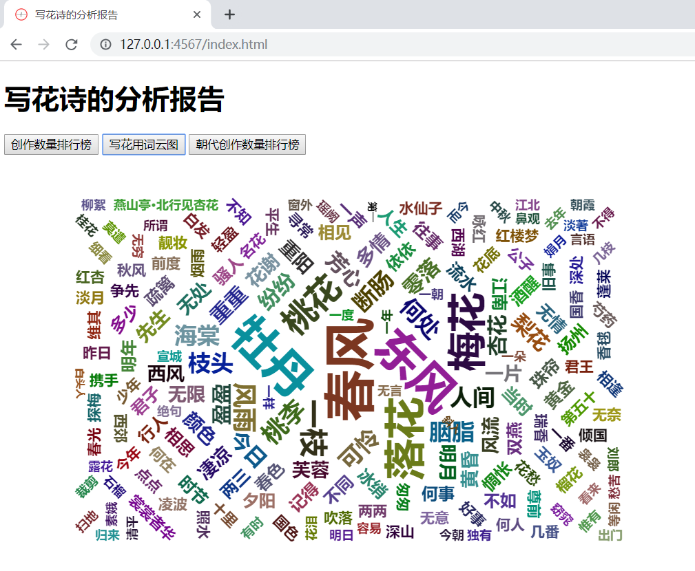
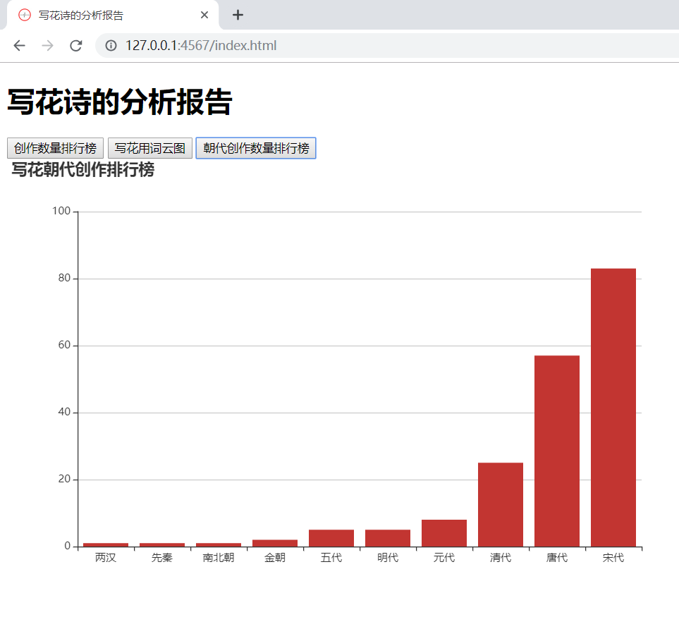
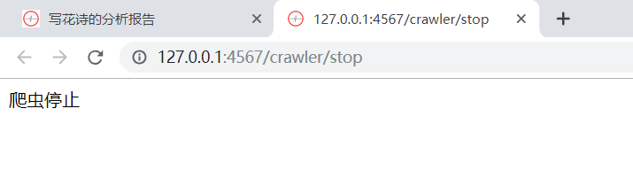

## 项目名称
花儿知多少
## 项目描述
这是一个用于分析写花的诗的项目，主要分析每个诗人创作诗的数量、写花诗的词展示为词云以及分析每个朝代的写花的诗的总数。
## 涉及技术
Java：面向对象、设计模式、多线程、集合框架、JDBC编程、IO、Stream流
数据库：数据库设计
第三方：HtmlUnit、Ansj分词器、Sparkjava、druid(数据库链接池）
前端：HTML、JavaScript、jQuery、Echarts
## 实现功能
1）统计出写花的作者及其创作数量
2）用词云的形式展示出写花的词
3）统计出朝代和该朝代写花的诗数量
## 具体实现

## 结果展示

